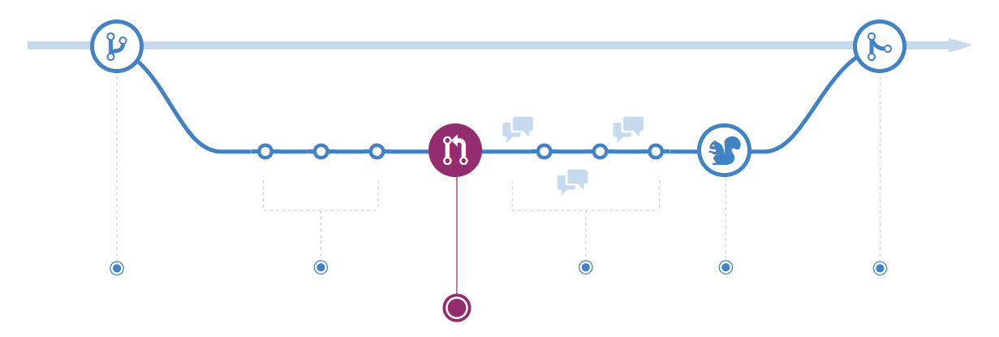

# 发起 Pull Request

## 发起 Pull Request

Pull Requests 会启动你所提交内容的讨论。因为它们与 Git 紧密结合，所以任何人都可以确切地知道如果他们接受你的请求，将会合并哪些更改。

你可以在开发过程中随时发起 Pull Request：在很少或根本没有代码但希望分享一些截图或想法时，在你遇到困难并需要帮助或建议时，或者在你准备好让别人评审你的工作时。通过在 Pull Request 消息中使用 GitHub 的 @提醒 系统，你可以征询特定人员或团队的反馈，不管他们身处何处。

### **高级技巧**

Pull Requests 对于贡献开源项目和管理对共享仓库的更改很有用。如果你使用的是 Fork & Pull 模式，Pull Requests 提供了一种方式来通知项目维护者什么是你所希望他们考虑的更改。如果你使用的是共享仓库模式，Pull Requests 则会在合并到 `master` 分支之前帮助启动代码评审和有关建议更改的对话。

