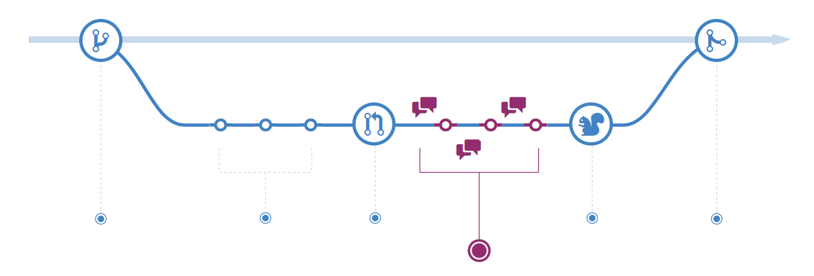

# 讨论并评审代码

## 讨论并评审代码

一旦一个 Pull Request 被发起，评审你所做的更改的人员或团队可能会有问题或意见。也许是编码风格与项目指南不符，更改缺少单元测试，或者一切看起来都很棒，符合要求。Pull Requests 旨在鼓励和记录此类对话。

你还可以根据相关提交的讨论和反馈继续推送到相应分支。如果有人指出你忘记执行某些操作或代码中存在错误，则可以在分支中修复它并推送更改。GitHub 将在统一的 Pull Request 视图中显示你的新提交以及可能收到的任何其他反馈。

### **高级技巧**

Pull Request 注释是以 Markdown 格式编写的，因此你可以嵌入图片和表情符号，使用预格式化的文本块和其他轻量级格式。

